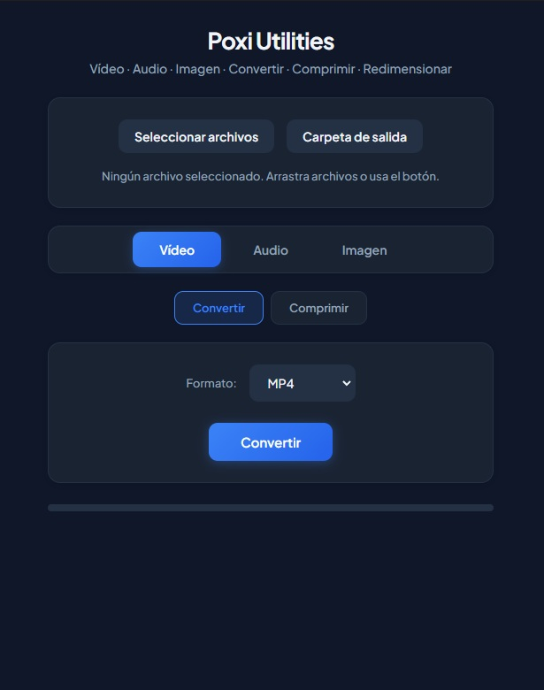

<p align="center">
  
</p>

<h1 align="center">🎬 Poxi Utilities – Videos, Fotos y Audio</h1>

<p align="center">
  <strong>Conversor universal de archivos multimedia para Windows</strong>
</p>

<p align="center">
  
  
  
</p>

<p align="center">
  Interfaz moderna en <strong>Electron + React</strong> con modo oscuro azulado.<br>
  Convierte vídeo, audio e imágenes con unos clics.
</p>

<p align="center">
  <em>v1.1.0</em> — FFmpeg incluido; no necesitas instalarlo.
</p>

---

## ✨ Características principales

| Categoría | Funcionalidad |
|-----------|---------------|
| 🎥 **Vídeo** | Convertir (MP4, MOV, AVI, MKV, WebM, M4V) · Extraer audio · Comprimir (CRF 18-33) |
| 🎵 **Audio** | Convertir (MP3, WAV, M4A, AAC, OGG, FLAC) · Sample rate, bitrate · Comprimir a MP3 |
| 🖼️ **Imagen** | Convertir (JPG, PNG, WebP, BMP, TIFF, GIF, DNG) · Comprimir · Redimensionar |

---

## 🚀 Interfaz

- 🌙 **Tema oscuro** azul elegante
- 📂 **Arrastrar y soltar** para seleccionar archivos
- 👁️ **Vista previa** de imágenes seleccionadas
- 📊 **Progreso** por archivo cuando hay cola («Archivo 2 de 5»)
- ✅ **Modal integrado** al terminar con botón «Abrir carpeta»
- ⏹️ **Botón Cancelar** para detener conversiones
- 🛡️ **Validación** de formatos (aviso si se mezclan tipos incompatibles)

---

## 📥 Descargas

<p align="center">
  <a href="https://github.com/PoxiiTV/Convertidor-Universal-.mp4.mp3.jpg/releases">
    
  </a>
</p>

- 📦 **Portable** — No requiere instalación (~220 MB)
- 🔧 **Instalador** — Setup con accesos directos (~220 MB)

> ✅ **FFmpeg incluido** — Todo listo; no instales nada más

---

## 🖥️ Uso rápido

1. Ejecuta el `.exe` (Portable o tras instalar)
2. Arrastra archivos o usa **Seleccionar archivos**
3. Elige pestaña: **Vídeo** · **Audio** · **Imagen**
4. Selecciona modo: **Convertir** · **Comprimir** · **Redimensionar**
5. Configura opciones y pulsa el botón de acción ▶️

---

## 🛠️ Desarrollo

### Backend (Python)

```bash
pip install -r requirements.txt
python build_backend.py   # → poxi-ui/backend/converter_backend.exe
```

### Frontend (Electron + React)

```bash
cd poxi-ui
npm install
npm run electron:dev      # Modo desarrollo con recarga en caliente
```

### Build completo

```bash
build_electron.bat        # Desde la raíz (descarga FFmpeg + compila)
```

El script descarga FFmpeg automáticamente si no existe en `poxi-ui/ffmpeg/`.

---

## 📁 Estructura

```
├── converter_core.py      # Lógica de conversión
├── converter_backend.py   # Backend headless
├── build_backend.py
├── download_ffmpeg.py     # Descarga FFmpeg para incluir en la app
├── build_electron.bat
├── poxi-ui/
│   ├── electron/
│   ├── src/               # React UI
│   ├── backend/           # converter_backend.exe
│   ├── ffmpeg/            # ffmpeg.exe (descargado)
│   └── release/           # EXE finales
└── requirements.txt
```

---

## 📄 Licencia

MIT © Poxi
